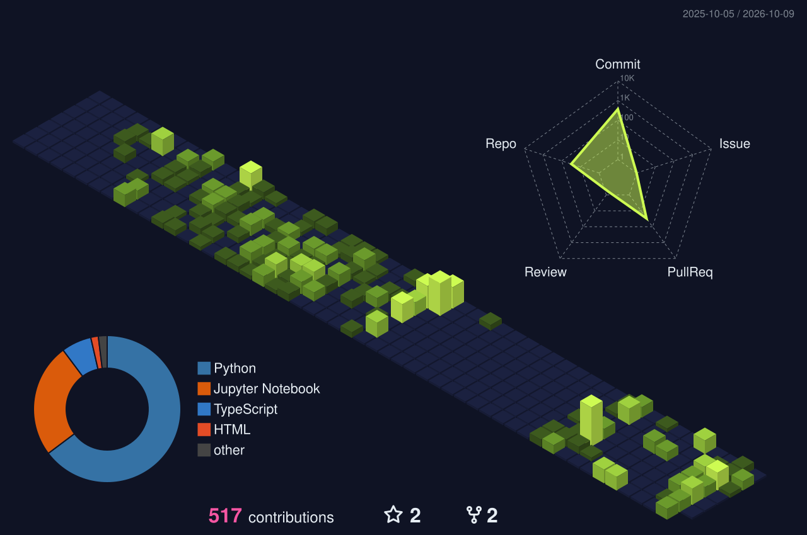

<!-- Header is generated: edit scripts/build_terminal.py, then `python scripts/build_terminal.py` -->
<a href="https://srinath.io">
  
</a>

<div align="center">

[](https://srinath.io)
[](https://www.linkedin.com/in/srinath-muppala)


</div>

### `$ cat about.md`

I build AI systems that actually *do* something — not another chatbot wrapped around an API. I take a messy real-world problem, find where AI genuinely helps, then own the whole thing: agents, models, APIs, databases, infra, deployment and the UX.

Most recently I turned architectural floor-plan mapping at **Inovonics** from a **two-day manual process into minutes**, and built **GymBuddy** because I was tired of logging workouts by hand. Give me a workflow everyone has accepted as *"that's just how we do it"* and I'll probably spend my weekend automating it.

### `$ ls ~/projects --featured`

| repo | what it does | receipts |
|:--|:--|:--|
| [**GymBuddy**](https://github.com/srinath-19/GymBuddy) | Voice-first AI workout companion: natural-language logging, a GPT-4o Vision form coach, a hands-free pacer with a wake word | 4-agent OpenAI Agents SDK system, 23 tools · Cloud Run CI/CD |
| [**PricePilot**](https://github.com/srinath-19/PricePilot_Fine-Tune_LLaMA-3.2) | QLoRA fine-tune of LLaMA 3.2 3B for price prediction, served with vLLM | 820K-item dataset · 3 LoRA adapters · 18 req/s @ p95 0.9 s |
| [**DealHunter AI**](https://github.com/srinath-19/DealHunter_AI-Autonomous-Multi-Agent-Deal-Discovery-Engine) | Autonomous 5-agent engine that decides on its own when to scan, price and notify | fine-tuned pricer on Modal serverless GPUs · 60+ tok/s |
| [**Document Copilot**](https://github.com/srinath-19/Full_Stack_RAG) | Enterprise RAG over SEC filings with streaming, citable answers | pgvector + Postgres FTS fused by RRF · citation self-correction |
| [**GraphFusion RAG**](https://github.com/srinath-19/GraphFusion_RAG) | Hybrid knowledge-graph + vector retrieval for multi-hop Q&A | query rewriting · LLM reranking · MRR / nDCG / LLM-as-judge evals |
| [**Production LLM API**](https://github.com/srinath-19/Production_LLM_API_Endpoint) | Hardened FastAPI + LangGraph endpoint | 9-class prompt-injection detection · PII redaction · model failover |

<details>
<summary><code>$ ls ~/projects --all</code></summary>
<br>

| repo | what it does | receipts |
|:--|:--|:--|
| [**Autonomous Traders**](https://github.com/srinath-19/Autonomous_Traders_MCP-AGENTS-TOOLS) | Four AI traders running concurrent trade/rebalance cycles on live market data | 3 MCP servers · per-trader knowledge graphs |
| [**BuffRelay**](https://github.com/srinath-19/backend_buzzbuddy) | Distributed WebSocket messaging on Cloud Run | ~20k msgs/s via Kafka outbox · broadcast p95 68 ms over 1,500 rooms |
| [**Music Separation · K8s**](https://github.com/srinath-19/Music-seperation-Kubernetes) | Splits songs into stems, one Kubernetes pod per stage | median job 92 s → 64 s · Redis Streams + MinIO |
| [**ARGONAUT**](https://github.com/srinath-19/ARGONAUT-Vision-Language-QA-on-VizWiz) | Vision-language QA for blind users' photos (VizWiz) | ViT + BERT attention fusion · 94% answerability |
| [**Clarity**](https://github.com/srinath-19/Clarity-Unmasking_Political_Question_Evasions) | Detects evasion strategies in political Q&A | multi-task DeBERTa-v3 · 0.70 macro-F1 |
| [**CourtVision**](https://github.com/srinath-19/Tennis_analysis_ball-player-court) | Tracks tennis players, ball and court keypoints | YOLOv12 + YOLOv5x + ResNet-50 · ball recall 60% → 90% |

</details>

### `$ cat stack.yml`

```yaml
languages:   [Python, TypeScript, SQL, C++, Java, Bash]
llm_agents:  [OpenAI Agents SDK, LangGraph, LangChain, LiteLLM, MCP, vLLM, Hugging Face]
fine_tuning: [QLoRA, LoRA / PEFT, TRL SFTTrainer, bitsandbytes, Modal]
retrieval:   [pgvector, ChromaDB, hybrid search, RRF, GraphRAG, LLM reranking]
ml_cv_nlp:   [PyTorch, TensorFlow, scikit-learn, OpenCV, YOLO, ViT, BERT, DeBERTa]
backend:     [FastAPI, Django, Node.js, Express, Socket.IO, Celery, Kafka]
data:        [PostgreSQL, MySQL, MongoDB, Redis, Supabase, MinIO]
cloud:       [GCP, AWS, Docker, Kubernetes, Terraform, GitHub Actions]
evals_ops:   [LangSmith, LLM-as-judge, Weights & Biases, MLflow, k6]
frontend:    [Next.js, React, Tailwind CSS]
```

### `$ git log --graph career`

```text
* (HEAD -> main)  open to full-time AI/ML & SWE roles · SF Bay Area, open to relocation
|
* 2025 – 2026     AI Engineer @ Inovonics · Boulder, CO
|                 floor-plan mapping: 2 days → minutes
|                 YOLOv12-OBB · FastAPI · Celery · Redis · OR-Tools CP-SAT · GCP
|
* 2024 – 2026     M.S. Computer Science (AI) @ CU Boulder · GPA 3.87
|
* 2023 – 2024     Undergraduate Researcher @ SRM
|                 real-time tomato-harvest detection on AWS · 97% accuracy
|                 paper: "Identification of Harvestable Tomato using YOLOv8" (IEEE, 2024)
|
* 2022 – 2023     Software Developer @ Aaruush, SRM
|                 p95 800 ms → 450 ms · 99.9% uptime · 5k concurrent users load-tested
|
* 2020 – 2024     B.Tech Computer Science @ SRM · GPA 3.98
```

### `$ ./contributions --render 3d`



---

<div align="center">
<sub><code>basically, I make computers do the boring stuff so humans can work on the interesting stuff. — exit 0</code></sub>
</div>
